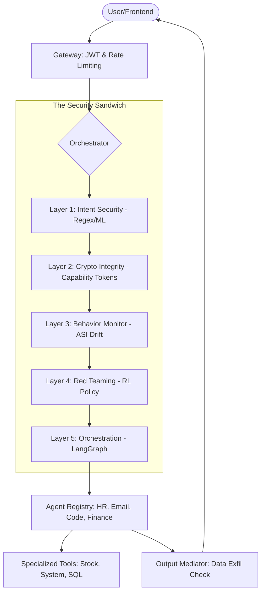

# 🗺️ Rectitude.AI Codebase Map

This document is the high-fidelity structural source of truth for the **Rectitude.AI** project. It is designed to save context tokens by providing a comprehensive, explainable overview of the architecture, security layers, and data flows.

---

## 🏗️ System Architecture

The core of Rectitude.AI is a **5-Layer Security Sandwich** that wraps LLM inference in multiple defensive tiers.

---

## 📂 Directory Structure & Purpose

### 1. `backend/` - Core System
The engine room of the application.
- **`api/`**: FastAPI endpoints. Handlesauth, health checks, and request routing.
- **`gateway/`**: Security perimeter. Implements JWT verification and Redis-based rate limiting.
- **`agents/`**: The Multi-Agent System (MAS).
    - `registry.py`: Dynamic lookup for specialized agents.
    - `base.py`: Abstract foundation for all agents.
    - `hr_database_agent.py`, `email_agent.py`, `financial_advisor_agent.py`, `code_exec_agent.py`: Specialized implementations.
- **`layer1_intent_security/`**: Fast-path defense. Uses regex (`regex_prefilter.py`) and ML classifiers to block prompt injections.
- **`layer2_crypto/`**: Cryptographic authority. Uses `capability_tokens.py` to grant scoped permissions to agents (preventing privilege escalation).
- **`layer3_behavior_monitor/`**: Long-term drift tracking. Uses `asi_calculator.py` (Agent Stability Index) to detect multi-turn social engineering.
- **`layer4_red_teaming/`**: Defensive hardening. `attack_runner.py` executes RL-based tests to find vulnerabilities in policies.
- **`layer5_orchestration/`**: The conductor. `orchestrator.py` determines which layers to run based on risk scores (Tier 1-3 routing).
- **`models/`**: Pydantic schemas for requests/responses and LLM provider integrations.
- **`storage/`**: Audit logs, policy stores, and persistence.
- **`utils/`**: Shared logging and exception handlers.

### 2. `.agents/skills/` - Integrated Capabilities
Project-specific agent instructions and workflows.
- **`project_management/`**: Maintains LOG and MAP (Source of Truth).
- **`gsd/`**: "Get Shit Done" - High-speed subagent implementation engine.
- **`security-auditor/`**: specialized instructions for auditing security layers.
- **`backend-architect/`**: patterns for scalable MAS architecture.
- **`python-pro/`** & **`fastapi-pro/`**: language and framework mastery.
- **`subagent-driven-development/`**: The core logic behind the GSD workflow.
- **`systematic-debugging/`**: Root-cause analysis protocols.
- **`lint-and-validate/`**: code quality enforcement.

### 3. `scripts/` - Pipeline & Evaluators
- `unified_evaluator.py`: The master security test suite that benchmarks all layers.
- `run.sh`: One-click deployment script.

### 3. `DOCS/` - Technical Deep Dives
- `TECHNICAL_RATIONALE.md`: Why we chose this architecture.
- `FEATURE_SHOWCASE.md`: benchmarks and capability list.

---

## 🔄 Data Flow Trace (Inference)

1. **Gateway**: Verifies JWT and checks Redis rate limits.
2. **Orchestrator (Tier 1)**: Runs `regex_prefilter`. If score > 0.85, request is blocked instantly (~5ms).
3. **Orchestrator (Tier 2)**: For ambiguous prompts, runs parallel ML classifiers (Injection & Perplexity).
4. **ASI Update**: `asi_calculator` updates the session's drift score based on bag-of-words similarity and token variance.
5. **Layer 2 (Tokens)**: If tool calls are requested, orchestrator issues a `Capability Token` scoped to specific tools.
6. **Agent Execution**: The registry selects the target agent. The agent's base class verifies the Capability Token before calling any tool.
7. **Output Mediator**: Scans the LLM response for data exfiltration patterns (API keys, DB dumps, sensitive regex) before returning to user.

---

## 🛠️ Global Constants & Config

Key parameters from `backend/gateway/config.py` and `.env`:
- `RISK_THRESHOLD`: `0.50` (When to escalate from Tier 1 to Tier 2).
- `ASI_ALERT_THRESHOLD`: `0.55` (When a session is marked suspicious).
- `TOKEN_TTL`: `300s` (Capability token lifespan).
- `REDIS_URL`: Primary session/rate-limit state.

---

> [!TIP]
> **Credit Saving Rule**: Before exploring individual files, refer to this map. Only read specific files if you need to modify logic or understand a complex implementation detail not covered here.

*Last Updated: 2026-04-17 12:45:00*
