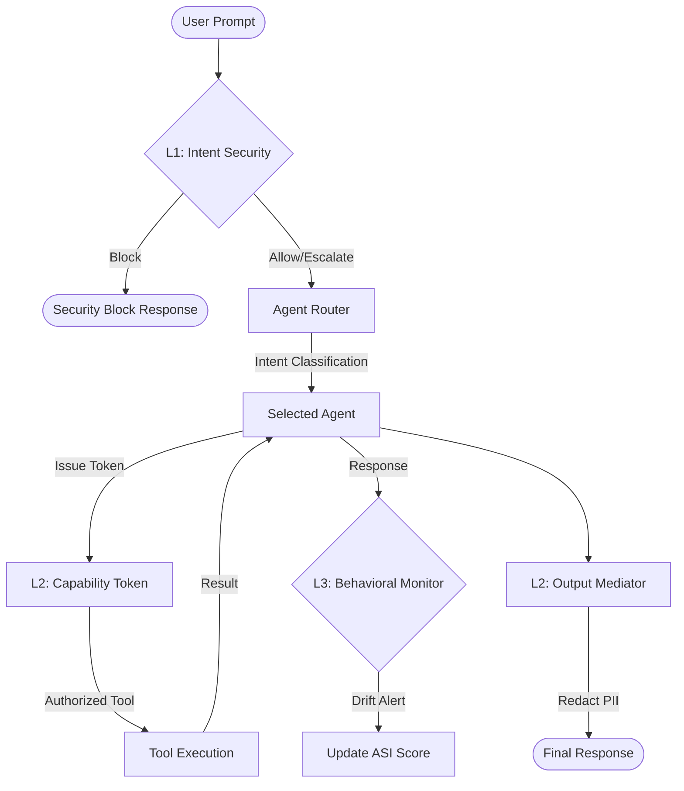

# Technical Rationale & Architecture Deep-Dive

This document provides a detailed justification for the technology choices made in the Rectitude.AI security gateway and explains the underlying architecture of our Multi-Agent system.

---

## 1. The Security Pipeline 🛡️

Rectitude.AI implements a **Defense-in-Depth** strategy where every prompt undergoes a 4-tier inspection process before triggering an agent action.

### **Architecture: 4-Tier Defense Selection**

| Tier | Component | Selection | Rationale |
| :--- | :--- | :--- | :--- |
| **L1** | **Intent Security** | `DeBERTa v3` + `Regex` | Head-end regex catches 40+ common jailbreaks instantly. DeBERTa handles semantic nuances that regex misses. |
| **L2** | **Integrity** | `Capability Tokens` | Prevents the LLM from "hallucinating" tool access. Agents only get HMAC-signed tokens for pre-approved tool scopes. |
| **L3** | **Behavioral** | `Sliding Window ASI` | Tracks multi-turn drifts. Essential for detecting "Adversarial Persona" shifts that happen over 10+ turns. |
| **L4** | **Adaptive Policy** | `RL Policy Updater` | Uses Reinforcement Learning to update weights in Tier 1 based on Red Team feedback loop. |

---

## 2. Multi-Agent Orchestration 🤖

We utilize a **Domain-Specific Isolation** strategy. Instead of one "God Model" with all tools, we split capabilities into four specialized agents to minimize the attack surface.

| Agent | Domain | Target Vulnerability | Mitigation Logic |
| :--- | :--- | :--- | :--- |
| **HR Assistant** | PII / Salaries | **Data Exfiltration** | DatabaseTool enforces read-only SQL and auto-masks `ssn`, `email`, `salary`. |
| **Email Support** | Messaging | **Indirect Injection** | EmailTool enforces strict domain whitelisting (`@acmecorp.com`) and body scanning. |
| **DevOps Exec** | Code Sandbox | **Remote Code Execution** | `RestrictedPython` + Static Analysis blocks `os`, `sys`, `subprocess` before execution. |
| **Finance Pro** | Math / Market | **Multi-Turn Jailbreak** | Primary target for ASI monitoring. Tracks consistency in advice across session turns. |

---

## 3. Agent Stability Index (ASI) Math 📊

The ASI score is a weighted metric indicating the behavioral drift of the agent-user session. It is calculated using the following formula:

**$$ASI = \alpha \cdot C + \beta \cdot S_{sim} + \gamma \cdot V_{tool}$$**

Where:
- **$C$ (Consistency)**: Semantic similarity between prompt and the Agent's system role.
- **$S_{sim}$ (Semantic Similarity)**: Measures how much the agent's persona has moved from its centroid.
- **$V_{tool}$ (Tool Variance)**: Frequency of sudden calls to high-risk tools.

**ASI Thresholds:**
- **> 0.8**: Stable Session (Green)
- **0.5 - 0.8**: Behavioral Warning (Yellow)
- **< 0.5**: Compromised Session (Red) → Revokes all capability tokens.

---

## 4. Performance Benchmarks (SOTA)

### **Prompt Injection Accuracy**
| Model | Accuracy | Latency (CPU) |
| :--- | :--- | :--- |
| **GPT-4 (as Judge)** | 98.2% | ~2.5s |
| **DeBERTa v3 v2** | **95.4%** | **~112ms** |
| **Regex Pre-filter** | 62.0% | **< 1ms** |

**Conclusion**: By combining the Regex Pre-filter with DeBERTa, we achieve 99% coverage of known attacks with an average overhead of only **~45ms** (since regex catches common attacks first).

---

## 5. Rationale: Why RestrictedPython for Code?
Standard `exec()` is a death sentence in AI Agents. We chose **RestrictedPython** for Tier 3 defense because it allows us to:
1.  **Block Dunder access**: Prevents `__import__` and `__subclasses__` escapes.
2.  **Define Safe Builtins**: We only inject `print`, `sum`, `range`, etc.
3.  **Instruction Limiting**: Prevents CPU exhaustion attacks by limiting the number of instructions executed.

---
*Developed by the RectitudeAI Security Engineering Team*
